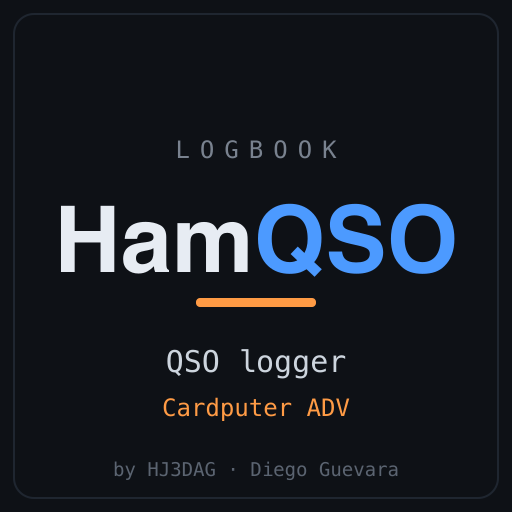

# HamQSO — firmware for the M5Stack Cardputer ADV

<p align="center"></p>

**HamQSO** is a ham‑radio **QSO logger** for the [M5Stack Cardputer ADV](https://docs.m5stack.com/en/core/Cardputer-Adv). Log contacts to the microSD card as standard **ADIF**, with live DXCC country decode, band auto‑fill, a MODE picker, NTP/manual UTC clock, and on‑device review/edit.

This repository distributes the **ready‑to‑flash firmware binary**. (The source code is maintained privately.)

> 📖 New to it? Read the **[User Guide](USER-GUIDE.md)** — three screens, a handful of keys.

## ⚠️ Device compatibility

- ✅ **M5Stack Cardputer ADV** (the newer model, StampS3A).
- ❌ **Not** the original M5Stack Cardputer — it has different microSD wiring, so this build won't read the card on it.

The `-adv` in the file name marks it as the **ADV** build.

## Download

Grab **`hamqso-adv.bin`** from the [**Releases**](../../releases/latest) page. It's a merged image (bootloader + partitions + app) — flash it at offset **`0x0`**.

## Install (pick one)

**A. M5Launcher** ([bmorcelli/Launcher](https://github.com/bmorcelli/Launcher)) — on the device
- **From SD:** copy `hamqso-adv.bin` to the SD card, open the SD menu in Launcher, select it, Install.
- **From URL:** add a favorite pointing to the release asset's direct download URL.

**B. M5Burner** (desktop, no command line)
- Open M5Burner → **Burn from file** → select `hamqso-adv.bin` → device port → Burn.
- (HamQSO is also published in M5Burner's catalog under **Cardputer ADV** — search "HamQSO".)

**C. Web flasher** (browser, no install)
- Open <https://espressif.github.io/esptool-js/>, **Connect**, add `hamqso-adv.bin` at offset **`0x0`**, **Program**.

**D. esptool (command line)**
```bash
esptool.py --chip esp32s3 --baud 1500000 write_flash 0x0 hamqso-adv.bin
```

If the board doesn't auto‑enter download mode, hold **G0** while tapping reset, then flash.

## First run

1. Press **`` ` ``** (backtick) to reach **SET** → set your callsign, grid, Wi‑Fi, and UTC offset.
2. In **SET → Date & time**, turn on **Auto‑sync** (or set the clock manually). The logger won't save until the clock is set.
3. Press **`` ` ``** to **QSO** and start logging. Files land on the SD card at `/HamQSO/logs/YYYY-MM-DD.adi` (standard ADIF, importable into LoTW/N1MM/Log4OM).

Full walkthrough: **[User Guide](USER-GUIDE.md)**.

## Notes

- The Cardputer ADV has **no battery‑backed clock**; set the time each power‑on (auto‑sync over Wi‑Fi handles this when configured).
- The binary includes third‑party libraries (Arduino‑ESP32, M5Unified) under their respective licenses.
- Provided as‑is, no warranty. Feedback and bug reports welcome via Issues.

73! 📻
